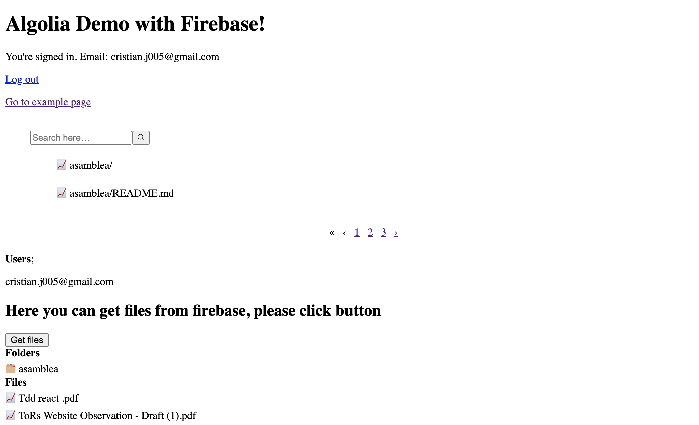

# Example: Firebase authentication and Algolia

This example includes Firebase authentication and serverless and instant search with algolia 
## How to configure project

1. Create `.env` like `.env.example`
2. Create an project on Firebase with Storage, Firestore and Functions
3. Get `service-account.json` from firebase settings and paste on `utils/auth/service-account.json`
4. Create an account on [Algolia](https://www.algolia.com/)
5. Create an index with name `files_search` 

## How to run

1. Deploy functions 
  `cd functions/ && firebase deploy`
2. Upload files on Firebase Storage 
3. See index on Firestore and Algolia Dashboard
4. Run app 
  `yarn dev`
5. Fork and star this repo!

## Screenshots
Search with algolia and files from storage

Search files with algolia

